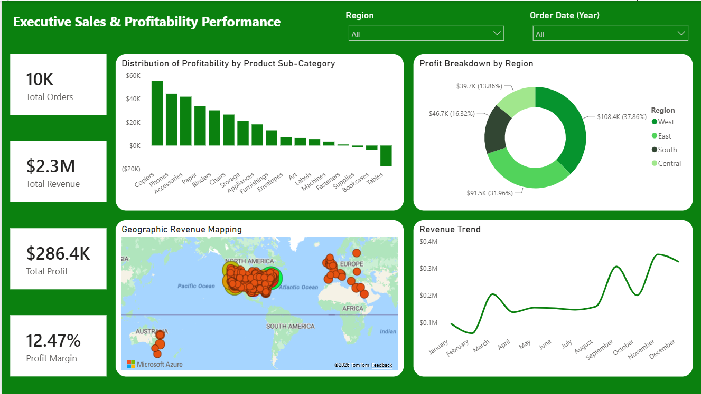
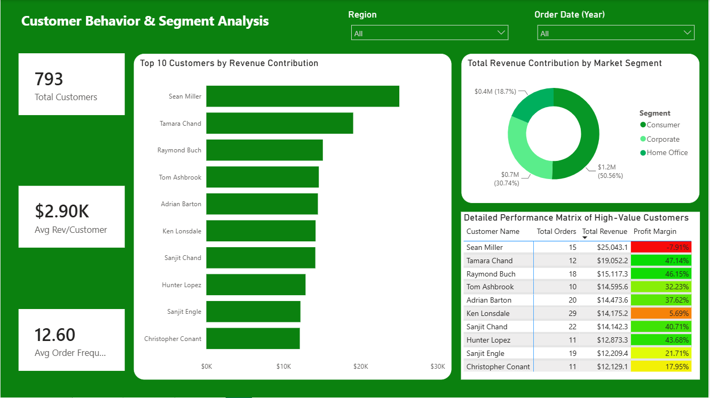
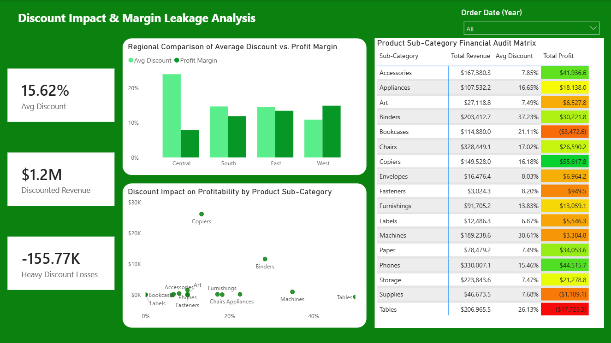

# AnalystLab_Week_4_Project
Visualization and Data Storytelling

Superstore Sales Performance and Margin Leakage Analysis
AnalystLab Africa Data Analytics Internship Project

## Project Objective

The objective of this project was to transition from database querying to advanced data visualization, key performance indicator (KPI) design, and data storytelling. The project focused on building an interactive multi-page dashboard to convert raw transactional data into business insights, identify hidden profit losses, and help stakeholders make data-driven decisions.

## Datasets Used

### 1. Superstore Sales Dataset

* **Source:** Kaggle - Superstore Dataset
* **Description:** This operational dataset contains retail transactions for a global business over multiple years. It tracks:
    * **Order Details:** Order ID, Quantity, Sales, Discount, and Profit.
    * **Product Metadata:** Category, Sub-Category, and Product Name.
    * **Customer & Geography:** Customer Name, Segment (Consumer, Corporate, Home Office), Country, Region, and State.
    * **Temporal Logs:** Order Date and Shipping Date.

## Tools Used

### Microsoft Power BI (Desktop) 

Power BI was used as the primary tool to:
* Import, clean, and shape raw transactional data using **Power Query**.
* Write **DAX expressions** to build calculated measures for profit margins, and discount tracking.
* Design a clean, interactive user interface using filters, slicers, and conditional formatting to guide users through the data story.

## Data Cleaning & Transformation Steps

### 1. Data Type Validation & Structural Adjustments
* **Date Fields:** Converted order and shipping dates into standard date formats to allow accurate yearly and monthly trend tracking.
* **Financial Metrics:** Formatted Sales, Profit, and Discount columns as currency and percentages to keep numbers clean and consistent across all visuals.

### 2. Logic and DAX Calculations
* **Margin Corrections:** Built explicit DAX measures for Profit Margin to ensure that the grand totals accurately reflected total profit divided by total revenue, avoiding average-of-averages calculation errors.
* **Loss Isolation:** Formatted negative numbers clearly using conditional formatting color rules (bright red backgrounds) to quickly point out areas where the business is bleeding money.

## Key Findings

### 1. Executive Sales & Profitability Performance
* The business brought in a total revenue of **$2.3M**, achieving a **12.47% Profit Margin** across **10K Total Orders**.
* The **West Region** is the absolute financial powerhouse of the company, bringing in **$108.4K (37.86%)** of total profits. 
* Conversely, the **Central Region** shows a major drop in profitability, contributing only 13.86% of total profits despite generating healthy sales volume. This is driven directly by high promotional discount rates.
* *Visual Reference:* Detailed layout elements can be reviewed below
  

### 2. Customer Behavior & Segment Analysis
* The **Consumer Segment** is our primary commercial driver, making up **50.56% ($1.2M)** of the total customer revenue.
* A deeper look into high-value clients revealed a critical business risk: our top customer by revenue, *Sean Miller* ($25,043.1 in revenue), actually has a negative profit margin of **-7.91%**. This proves that high sales volumes do not always bring high profits.
* *Visual Reference:* Segment breakdowns and customer metrics are visible below
  

### 3. Discount Impact & Margin Leakage Analysis
* The store maintains an average discount rate of **15.62%**, which has led to **-$155.77K in heavy discount losses**.
* **Tables** are the single largest source of profit leakage in the company. Aggressive promotions (an average discount of 26.13%) resulted in a net loss of **-$17,725.5**. 
* **Bookcases** are also heavily losing money, experiencing a net loss of **-$3,472.6** due to a high 21.11% average discount rate.
* *Visual Reference:* The full financial audit grid is showcased below 

## Strategic Recommendations

### 1. Restructure the Promotional Discount Policy
* Immediately implement a strict cap on promotional discounts for low-margin sub-categories. Specifically, lower or eliminate the automatic discount rates on Tables (currently at a high average of 26.13%) and Bookcases (21.11%) to stop immediate cash bleeding.

### 2. Audit High-Volume, Negative-Margin Customer Accounts
* Re-evaluate the contract pricing models for top-tier revenue contributors who exhibit negative profit margins, such as *Sean Miller* (-7.91% margin). Implement volume-based pricing that mandates minimum profit margins so large accounts do not cause revenue leakage.

### 3. Target Marketing Budgets on High-Margin Categories
* Reallocate capital and promotional focus toward high-performing sub-categories like **Copiers** and **Phones**, which show strong net profits ($55,617.8 and $44,515.7 respectively) and maintain healthy performance under moderate discounting.

## Conclusion

This project proves how dangerous it is for a business to look only at top-line sales without tracking bottom-line profit margins. By diving past simple sales numbers and auditing discount rates, customer behavior, and product segments, I found invisible profit leaks. The interactive dashboard provides clear guidance for the business to protect its profit margins, fix broken promotional pricing strategies, and focus sales efforts on high-margin product lines.

